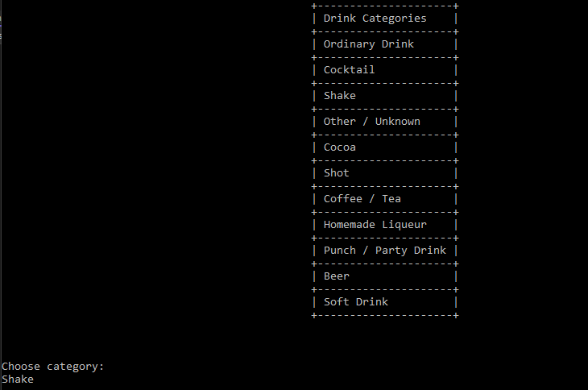
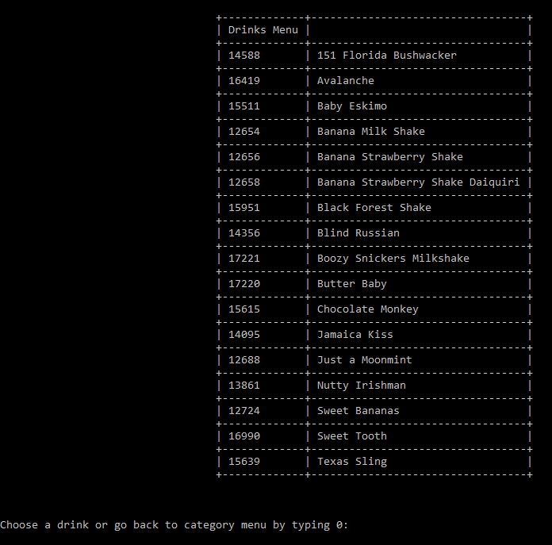
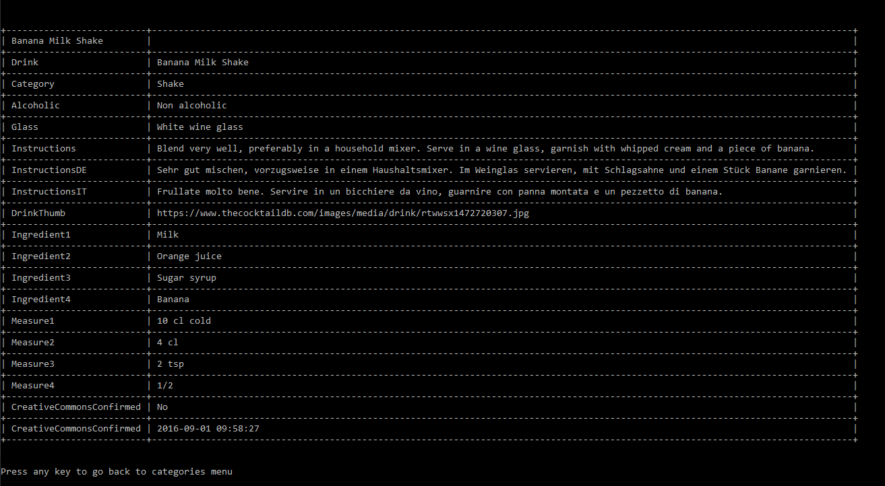

# DrinksApp-Http

Fourth console application in a series for learning .net. 

Application pulls data from a third party api and presents it in the console

## Requirements: 
 - [x] You were hired by restaurant to create a solution for their drinks menu.
 - [x] Their drinks menu is provided by an external company. All the data about the drinks is in the companies database, accessible through an API.
 - [x] Your job is to create a system that allows the restaurant employee to pull data from any drink in the database.
 - [x] You don't need SQL here, as you won't be operating the database. All you need is to create an user-friendly way to present the data to the users (the restaurant employees)
 - [x] When the users open the application, they should be presented with the Drinks Category Menu and invited to choose a category. Then they'll have the chance to choose a drink and see information about it.
 - [x] When the users visualise the drink detail, there shouldn't be any properties with empty values

## Features
- Category Menu
  - When opened app pulls category data from the api and shows it
  - 

- Drinks menu
  - When a category is chosen all drinks belonging to that category are pulled from the api and shown in a list
  - 

- Information about the drink
  - When a specific drink from a previous list is chosen app pulls all information about the drink and shows it to the user
  - 

- Reporting is done for all the tables with different information
  - "ConsoleTableExt" library was used for table display 

## Tech stack:
- ConsoleTableExt
- Newtonsoft.Json
- RestSharp
- .net 6.0

Special thanks to [Cappuccinocodes](https://github.com/cappuccinocodes) for help and advice.
